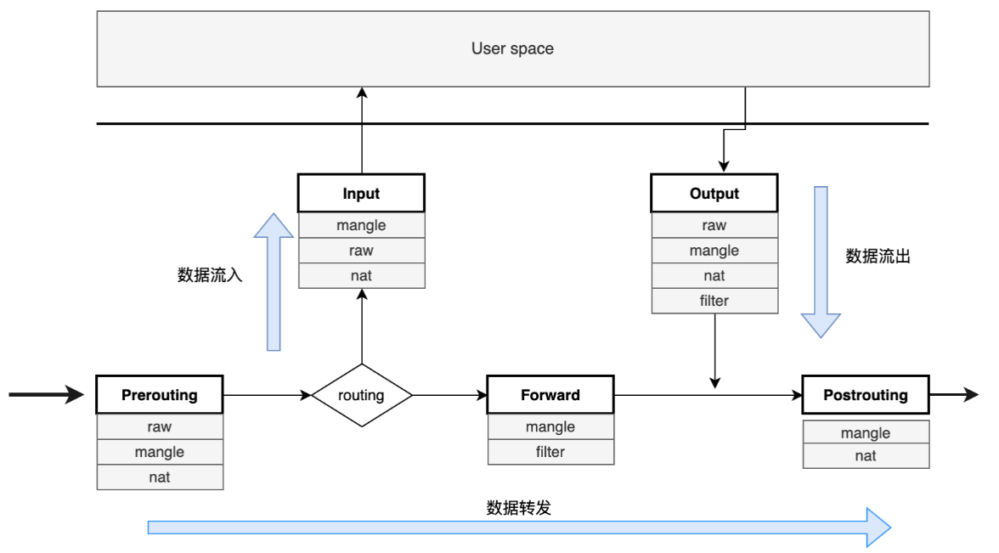

# Network Firewall Based On IPTABLES

**网络防火墙概念**

> 网络防火墙是指工作于网络或者主机边缘(通信报文进出口)，对于进出本网络或主机的报文根据事先定义的规则进行匹配检查，同时对能够匹配到的报文机型相应处理。

- 逻辑分类：
    - 主机防火墙：主要进行单个主机防护（个体）
    - 网络防火墙：处于网络入口或者边缘，一手托两家，用与隔离或者防护本地局域网（群体）

- 物理分类：
    - 硬件防火墙：在硬件级别实现一部分防护功能，通过软件实现另一部功能；性能高，成本高
    - 软件防火墙：基于软件实现，运行在通用平台上的防火墙；性能低，成本低


## IPTABLES&NETFILTER

**Iptables是什么**

iptables 是运行在用户的空间的应用软件，通过控制系统内核的netfilter模块，实现管理网络数据包的处理和转发，属于网络防火墙的用户态。

**netfilter**

Netfilter 是 Linux 内核中的一个软件框架，用于管理数据网络包。它处于在 OSI 的数据链路层和网络层，对数据包进行过滤、网络地址和端口转换，数据包日志，用户空间数据包排队和其他数据包处理。是网络防火墙的内核态。

## 四表五链

Netfilter 对数据报文的管理通过iptable_filter，iptable_mangle，iptable_nat，iptable_raw 四张表和 PREROUTING，INPUT，OUTPUT， FORWARD，POSTROUTING 五个钩子函数(链)实现。

| 表名 | 作用|
| ---| --- |
| filter|  实现网络包过滤, 默认表 |
| mangle |拆解报文，做出修改，并重新封装 的功能 |
| nat | 网络地址转换功能 |
| raw | 实现数据包连接追踪 |

> 优先级 `raw` > `nat` > `mangle` > `filter`

| 链名 | 作用|
| ---| --- |
| PREROUTING | 接收报文的第一个 hook 钩子函数，对数据报文进行目的地址进行判断 |
| INPUT | 目标地址是本机地址，则进入此 hook 钩子函数，发送到用户空间的应用程序处理|
| FORWARD | 经过路由判定后，目标地址不是本机的数据包数据包会流过此 hook |
| OUTPUT | 应用程序处理完成以后，报文会经过此 hook 流出 |
| POSTROUTING |本机准备发出的包或者转发的包会到达此 hook 钩子函数  |



## 主机防火墙

### iptables 规则

iptables 命令管理防火墙规则可以通过 man iptable 查看，下面是一些简单的使用。

- 链管理

```
# 新增自定义链
~]# iptables -N MYCHAIN
# 删除自定义链, 删除自定义的空链；先清除规则，才能删除链
~]# iptables -D MYCHAIN
# 设置链的默认规则 ACCEPT、DROP、REJECT
~]# iptables -P INPUT ACCEPT
# 重命名自定义且未被引用的链
~]# iptables -E MYCHAIN MY_CHAIN
# 查看当前链上的默认规则
~]# iptables -S
-P INPUT ACCEPT
-P FORWARD ACCEPT
-P OUTPUT ACCEPT 
```

- 规则管理

```
# 查看默认规则
~]# iptables -S
-P INPUT ACCEPT
-P FORWARD ACCEPT
-P OUTPUT ACCEPT
# 添加规则
~]# iptables -A INPUT -s 192.168.122.1/24 -d 192.168.122.86 -j ACCEPT
~]# iptables -A INPUT -s 0.0.0.0/24 -d 192.168.122.86 -j DROP

# 查看规则
~]# iptables -vnL --line-number
Chain INPUT (policy ACCEPT 0 packets, 0 bytes)
num   pkts bytes target     prot opt in     out     source               destination
1      598 50123 ACCEPT     all  --  *      *       192.168.122.1        192.168.122.86
2      243 30184 REJECT     all  --  *      *       0.0.0.0/0            192.168.122.86       reject-with icmp-port-unreachable

Chain FORWARD (policy ACCEPT 0 packets, 0 bytes)
num   pkts bytes target     prot opt in     out     source               destination

Chain OUTPUT (policy ACCEPT 623 packets, 74364 bytes)
num   pkts bytes target     prot opt in     out     source               destination

# 删除规则
~]# iptables -D INPUT 1

# 插入规则为第几条, g规则的前后会影响数据包的行为方式
~]# iptables -I  INPUT  1 -s 192.168.122.1/24 -d 192.168.122.86 -j ACCEPT
```

### 基本匹配

- `[!] -s, --source address[/mask][,...]`：指明原地址（范围）匹配；叹号表示取反
- `[!] -d, --destination address[/mask][,...]`：目标地址匹配
- `[!] -i, --in-interface name`：限制报文流入的接口，只能用于PREROUTING,INPUT,FORWARD链上；用于前半段
- `[!] -o, --out-interface name`：限制报文流出的接口，只能用于OUTPUT,FORWARD,POSTROUTING链上；用于后半
段
- `[!] -p{tcp|udp|icmp}`：限制协议
```
# 
```


